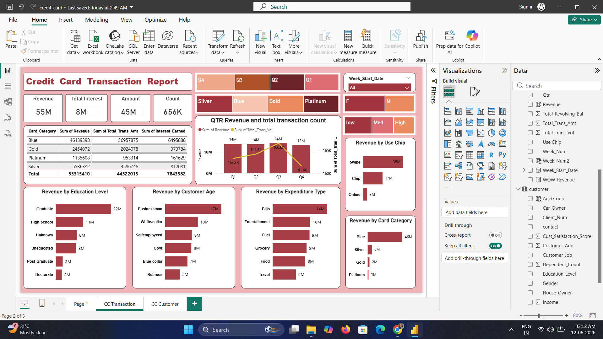
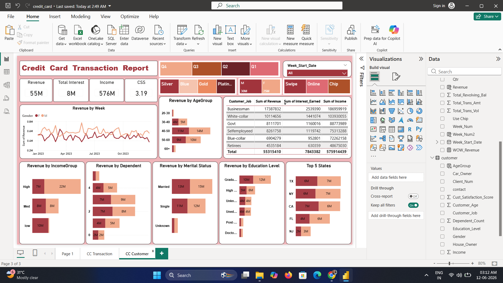

# 💳 Credit Card Transaction & Customer Insights Dashboard

## 📌 Project Overview

The Credit Card Transaction & Customer Insights Dashboard is a comprehensive Business Intelligence solution developed using **Power BI** to analyze credit card transactions, customer demographics, spending behavior, and revenue performance.

The dashboard combines transaction and customer datasets to provide a 360-degree view of business performance. It enables financial institutions to monitor transaction activities, understand customer spending patterns, identify high-value customer segments, and make data-driven decisions for business growth.

By leveraging interactive visualizations, KPIs, and dynamic filters, the dashboard transforms raw financial data into meaningful insights that support strategic planning and performance monitoring.

---

## 🎯 Project Objectives

* Analyze overall credit card transaction performance.
* Monitor revenue generation and transaction trends.
* Understand customer demographics and spending behavior.
* Identify high-value customer segments.
* Evaluate card category performance.
* Track transaction channels and customer engagement.
* Support business intelligence and decision-making processes.

---

## 🛠️ Tools & Technologies

### Business Intelligence

* Microsoft Power BI

### Data Transformation

* Power Query
* Data Modeling
* DAX (Data Analysis Expressions)

### Dataset

* Credit Card Transaction Data (`credit_card.csv`)
* Customer Information Data (`customer.csv`)

---

## 📊 Dashboard Features

### Transaction Analysis Dashboard

The transaction dashboard provides insights into:

* Total Revenue Generated
* Total Transaction Amount
* Total Interest Earned
* Total Transaction Count
* Quarterly Revenue Analysis
* Transaction Volume Trends
* Revenue by Card Category
* Revenue by Expenditure Type
* Revenue by Customer Profession
* Revenue by Education Level
* Revenue by Transaction Mode (Swipe, Chip, Online)

### Customer Analysis Dashboard

The customer dashboard focuses on:

* Customer Demographics
* Revenue by Age Group
* Revenue by Income Group
* Revenue by Marital Status
* Revenue by Education Level
* Revenue by Gender
* Revenue by Dependent Count
* Top Performing States
* Revenue Trends by Week
* Customer Segment Analysis

---

## 📈 Key Performance Indicators (KPIs)

The dashboard tracks the following KPIs:

* Total Revenue: **55M**
* Total Interest Earned: **8M**
* Total Transaction Amount: **45M**
* Total Transaction Count: **656K**
* Customer Income Analysis
* Customer Satisfaction Score (CSS)
* Revenue Growth Trends
* Card Category Performance

---

## 📷 Dashboard Preview

### Credit Card Transaction Dashboard



### Customer Insights Dashboard



---

## 📁 Project Structure

```text
Credit-Card-Transaction-Report/
│
├── credit_card.pbix      # Power BI dashboard file
├── credit_card.csv       # Credit card transaction dataset
├── customer.csv          # Customer information dataset
├── cc1.png               # Transaction dashboard screenshot
├── cc2.png               # Customer dashboard screenshot
└── README.md             # Project documentation
```

---

## 🔍 Key Insights Generated

### Transaction Insights

* Swipe transactions generate the highest revenue contribution.
* Blue Card category contributes the largest share of revenue.
* Bills and Entertainment represent major expenditure categories.
* Revenue performance varies across different card categories.

### Customer Insights

* High-income customers contribute significantly to total revenue.
* Customers aged 40–60 generate the highest revenue.
* Married customers show higher spending behavior compared to other groups.
* Graduate and White-Collar customer segments contribute a major portion of revenue.
* Certain states consistently generate higher transaction volumes and revenue.

---

## 🚀 Business Benefits

* Enables effective transaction monitoring.
* Improves customer segmentation strategies.
* Supports targeted marketing campaigns.
* Helps identify profitable customer groups.
* Enhances financial performance tracking.
* Facilitates data-driven business decisions.
* Improves customer engagement and retention strategies.

---

## 🔮 Future Scope

* Real-Time Transaction Data Integration
* Fraud Detection and Risk Analysis
* Predictive Customer Behavior Analytics
* Customer Lifetime Value Prediction
* AI-Based Revenue Forecasting
* Automated KPI Monitoring and Alerts
* Advanced Customer Segmentation Models

---

## ✅ Conclusion

This project demonstrates the practical application of Power BI for financial analytics and customer intelligence. By integrating transaction data and customer information into a unified reporting solution, the dashboard provides valuable insights into revenue performance, customer behavior, spending trends, and business growth opportunities.

The interactive reports and KPI-driven approach enable organizations to make informed decisions, improve customer engagement, and optimize financial performance through data-driven strategies.

---

## 👩‍💻 Author

**Anupriya Kumari Singh**

B.Tech Computer Science Engineering Student
- GitHub: https://github.com/Anupriya55509

  
⭐ If you found this project useful, consider giving it a star on GitHub.
